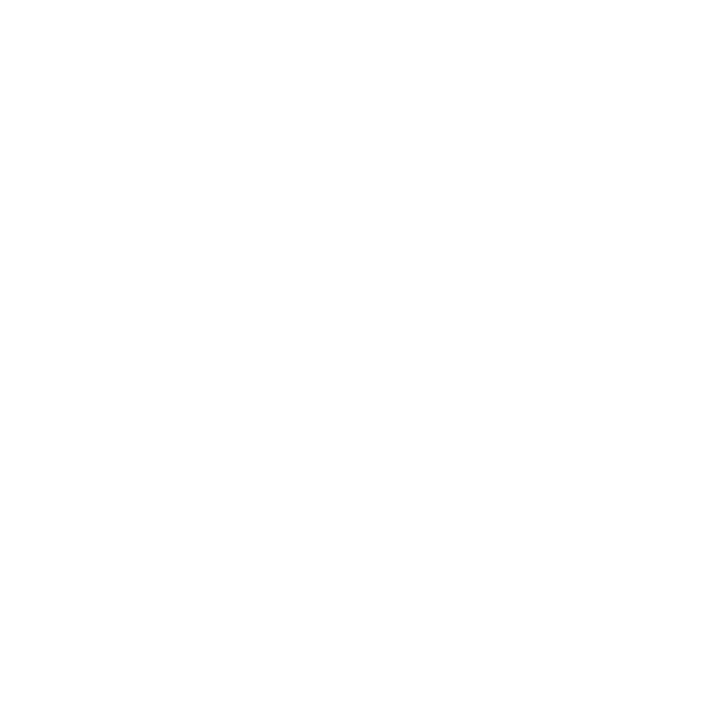

 

  

  <h3 align="center">WIZARD</h3>

  

    A score tracker and calculator for the popular german card game Wizard
     
    <a href="https://wizard.paulbertram.de"><strong>Visit Website»</strong></a>
     
     
  

## Build with:
<ul>
          <li>
            <a class="underline" href="https://astro.build/">Astro</a>
          </li>
          <li>
            <a class="underline" href="https://tailwindcss.com">TailwindCss</a>
          </li>
          <li>
            <a class="underline" href="https://daisyui.com">DaisyUI</a>
          </li>
          <li>
            <a class="underline" href="https://jquery.com/">JQuery</a>
          </li>
          <li>
            <a class="underline" href="https://iconify.design/">Iconify</a>
          </li>
        </ul>
        
## Credits:
<ul>
          <li>
            <a class="underline" href="https://codepen.io/jackrugile/pen/kQwPRO">Lightning Background</a>
          </li>
          <li>
            <a class="underline" href="https://codepen.io/jmolund/pen/jBqyqK">ScoreBoard</a>
          </li>
          
</ul>

## Legal

I am are not affiliated, associated, authorized, endorsed by, or in any way officially connected with the AMIGO Spiel + Freizeit GmbH, or any of its subsidiaries or its affiliates. The official AMIGO Spiel + Freizeit GmbH website can be found at https://www.amigo-spiele.de/.
